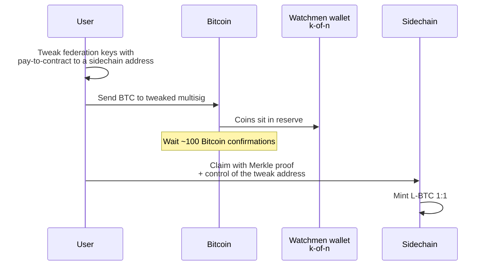
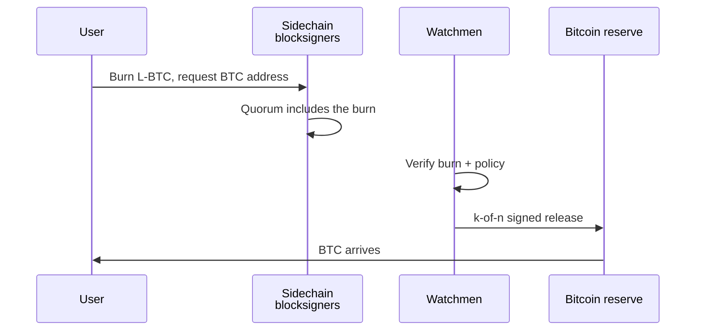

# Federated peg (shipped architecture)

**Primary diagram.** The federated peg is the architecture that actually shipped (Liquid-style). SPV is a **second, separate** diagram — see [spv-peg.md](./spv-peg.md). Do not blend them.

The 2014 sidechain paper treats federated and SPV pegs as alternatives that *could* run together or switch on hashrate. Production never did that. Liquid locked the reserve in a federation wallet so **Bitcoin itself never had to verify sidechain headers**.

## Split the functionary in two

Same machines, two jobs. Mixing them is how hybrid diagrams go wrong.

| Role | Chain it touches | Job |
|------|------------------|-----|
| **Blocksigner** | sidechain | Propose and threshold-sign sidechain blocks |
| **Watchman** | Bitcoin | Hold the k-of-n BTC reserve and sign peg-outs |

On Liquid those are the functionary HSMs. Federation *members* are a wider club; only the **functionary set** signs blocks and moves the peg.

Trust is not “the sidechain is as strong as Bitcoin.” Trust is: fewer than *k* watchmen collude, and the blocksigner quorum keeps producing valid sidechain blocks.

## Peg-in — BTC in, L-BTC out

User-driven. Watchmen do **not** vote to accept the deposit.



**Pay-to-contract** is the important detail: until the user reveals the Liquid address used as tweak, even the federation cannot tell that a Bitcoin payment is a peg-in.

## Peg-out — L-BTC in, BTC out

This is the federated surface. Bitcoin never checks a sidechain proof. **Watchmen do.**



No Bitcoin soft fork. No SPV opcode. The “proof” that the burn happened is the watchmen’s signatures on the mainchain spend.

## What the box actually contains

```text
                    Bitcoin
         ┌─────────────────────────────┐
         │  Federation reserve (k-of-n)│
         │  only watchmen can spend    │
         └─────────────▲───────────────┘
                       │ peg-out signatures
                       │
              ┌────────┴────────┐
              │   Functionaries │
              │  watchmen  │ blocksigners
              └────────┬────────┘
                       │ signed blocks
         ┌─────────────▼───────────────┐
         │         Sidechain           │
         │  L-BTC minted / burned 1:1  │
         └─────────────────────────────┘
```

## Three rules (do not collapse into SPV)

1. **Peg-in proof lives on the sidechain.** The sidechain checks a Bitcoin Merkle proof. Bitcoin does not check the sidechain.
2. **Peg-out proof lives in the federation.** Bitcoin checks a multisig, not a header chain.
3. **Consensus and custody are separate hats.** Blocksigners can halt the sidechain. Watchmen can steal or freeze the reserve. Those are different failures.

That is why Liquid could ship without an SPV-enabling Bitcoin change, and why the paper’s “use both / switch on hashrate” line stayed theoretical: a hybrid would still need Bitcoin to accept sidechain proofs on the peg-out path.

## Implementation map (this repo)

| Concept | Code |
|---------|------|
| Functionary roles | `cryptex_x.peg.roles` |
| Peg-in / peg-out flow | `cryptex_x.peg.federated` |
| Invariants A/B/C (three rules) | `tests/test_federated_peg.py` |

## Next

[SPV peg alone](./spv-peg.md) — lock / unlock by compact proofs on *both* chains — so the missing Bitcoin script change is visible instead of blended into the federation box.
