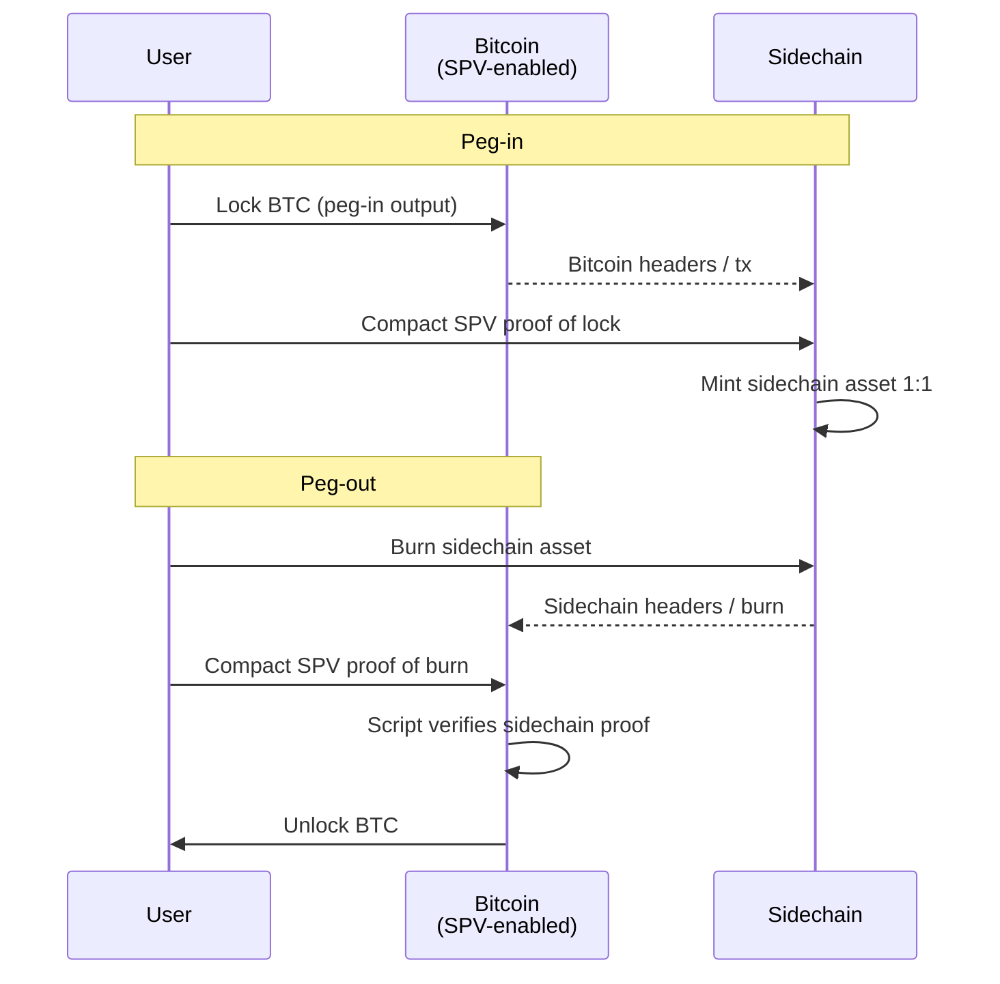

# SPV peg (second diagram — not shipped as Liquid)

**Separate from the federated peg.** Draw this alone so the missing Bitcoin script change stays visible. Do not fold SPV into the federation box.

See [federated-peg.md](./federated-peg.md) for the architecture that actually shipped.

## Intent

Lock / unlock by **compact SPV proofs on both chains**:

| Direction | Who verifies what |
|-----------|-------------------|
| Peg-in | Sidechain verifies a Bitcoin Merkle/SPV proof (similar surface to federated peg-in) |
| Peg-out | **Bitcoin** verifies a sidechain header proof (requires a Bitcoin consensus/script change) |

No k-of-n watchman custody as the peg-out authority. The mainchain itself accepts a sidechain proof.

## Why production did not ship this first

- Needs Bitcoin to learn sidechain proofs (soft fork / opcode / similar).
- The 2014 paper’s “run both / switch on hashrate” hybrid still depends on that mainchain change for the SPV peg-out leg.
- Liquid avoided it by putting peg-out proof in the **federation multisig** (watchmen), not in Bitcoin script.

## Diagram (target shape)



```text
         Bitcoin (must verify sidechain proofs)
         ┌──────────────────────────────┐
         │  lock / unlock via SPV rules │
         └─────────────▲────────────────┘
                       │ compact proofs both ways
         ┌─────────────┴────────────────┐
         │          Sidechain           │
         │     mint / burn 1:1          │
         └──────────────────────────────┘
```

## Contrast with federated peg

| | Federated (shipped) | SPV (this doc) |
|--|---------------------|----------------|
| Peg-in proof | Sidechain checks Bitcoin Merkle proof | Sidechain checks Bitcoin SPV proof |
| Peg-out proof | Watchmen k-of-n on Bitcoin multisig | Bitcoin script checks sidechain proof |
| Bitcoin change | None required | Required |
| Trust | &lt; k watchmen collude; blocksigner liveness | Bitcoin consensus + sidechain honesty assumptions |

## Status in CRYPEX-X-

Documentation stub only. No SPV runtime path. Executable model and tests cover the **federated** peg (`cryptex_x.peg.federated`).
